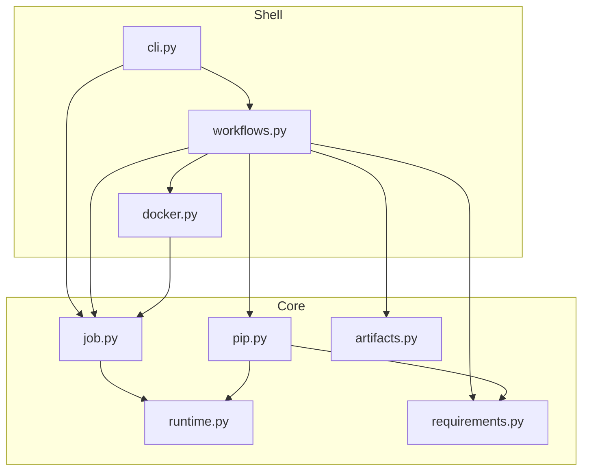

# Architecture

AWS Glue Toolkit is a **flat** Python package (no subpackages) organized in
**two layers**: **core** (domain) and **shell** (I/O and orchestration).

## Core

Domain facts, rules, and transforms. No CLI, Docker subprocesses, or terminal I/O.

| Module | Responsibility |
| --- | --- |
| `runtime.py` | Bundled Glue version JSON → `GlueRuntimeMetadata` |
| `job.py` | `pyproject.toml` validation → `GlueJobProject` |
| `requirements.py` | PEP 508 parsing; rewrite `file:` deps to container paths; extra mounts |
| `pip.py` | pip dry-run resolve, `pip wheel` bundling, image-pin wheel filtering; optional `PipRunner` |
| `artifacts.py` | Zip layout for `.dependencies.zip` and gluewheels tree staging |

Core modules must not import `docker`, `cli`, or `workflows`. Allowed sibling
imports: `job` → `runtime`, `pip` → `runtime`, `pip` → `requirements`.

## Shell

Process boundaries and use-case orchestration. Three roles:

| Role | Module | Responsibility |
| --- | --- | --- |
| **Infra** | `docker.py` | `docker run` argv builders, `run_job`, `run_tests`, `run_pip_in_container`, `run_container`; mount path constants |
| **Workflows** | `workflows.py` | `check`, `build`, `run`, `test`; wires pip to Docker via `_docker_pip_runner` |
| **Presentation** | `cli.py` | `gtk` entry point, `GtkCommandError`, exit codes, Rich panels |

`workflows` raises domain exceptions (`PipError`, `DockerError`, `ValueError`,
`OSError`, `RequirementPreparationError`) for `cli` to translate.

### FC/IS and DDD

| Lens | `workflows.py` |
| --- | --- |
| Functional core / imperative shell | Shell — orchestrates I/O |
| Domain-driven design | Application services — coordinates domain + infrastructure |

Both readings are valid: workflows must not contain domain rules (those live in
core) or presentation (Rich, exit codes).

## Dependencies

- **Core** must not import `docker`, `cli`, or `workflows`.
- **`pip`** must not import **`docker`** — use an injected `PipRunner` instead.
- **Only `workflows`** imports both **`pip`** and **`docker`**.

## Composition

| Concern | Owner |
| --- | --- |
| Generic Docker I/O | `docker.run_pip_in_container`, `run_container`, `run_job`, `run_tests` |
| pip-in-Docker adapter (exit codes → `PipError`) | `workflows._docker_pip_runner` via `pip.pip_error_from_returncode` |
| Prepare `file:` deps for container pip | `requirements.prepare_requirements` |
| Resolve (dry-run) | `pip.resolve_packages` |
| Wheel bundling + omit image pins | `pip.bundle_wheels` |
| Gluewheels zip assembly | `workflows.build` + `artifacts` staging helpers |
| Container mount paths | `docker.PIP_WORK_MOUNT`, `docker.GLUEWHEELS_STAGING_MOUNT`, `requirements` extra mounts; passed into pip by `workflows` |

## Command flows

### `gtk check`

`cli` → `workflows.check` → `requirements.prepare_requirements` → `pip.resolve_packages` → `docker.run_pip_in_container`

### `gtk build`

1. `artifacts.build_dependencies_zip` (host)
2. `workflows.build` → `requirements.prepare_requirements`
3. `artifacts.stage_gluewheels_zip` → `pip.bundle_wheels` → `artifacts.write_gluewheels_tree` → zip

`bundle_wheels` runs `pip wheel` in Docker, then deletes wheels whose
`name==version` matches bundled Glue image pins.

### `gtk run` / `gtk test`

`workflows.run` / `workflows.test` → `docker.run_job` / `docker.run_tests`

## Git and VCS dependencies

Git direct URLs are passed through to pip inside the Glue image. See
[README.md](../README.md#dependency-forms) for supported forms and limits.

## Adding code

1. Fact, rule, or transform → core (`runtime`, `job`, `requirements`, `pip`, `artifacts`)
2. Multi-step user workflow → `workflows.py`
3. Subprocess or Docker argv → `docker.py`
4. Terminal, Cyclopts, or exit codes → `cli.py`

If a change needs both pip and Docker, wire it in **`workflows`**, not in
**`pip`** or **`docker`**.

## Future extension: host pip for `check` / `build`

Not implemented (YAGNI). When confirmed, add execution policy in **`workflows`**
only: pass `runner=None` to `pip.resolve_packages` / `pip.bundle_wheels` for
host pip, or `_docker_pip_runner(job)` for the current Docker path. Core pip
logic stays unchanged.

## Public API

Library callers typically import:

- `from aws_glue_toolkit.job import load_pyproject, GlueJobProject`
- `from aws_glue_toolkit.runtime import load_runtime`
- `from aws_glue_toolkit.requirements import prepare_requirements`
- `from aws_glue_toolkit.artifacts import build_dependencies_zip`
- `from aws_glue_toolkit.workflows import check, build`

The `gtk` CLI is registered at `aws_glue_toolkit.cli:app`.
