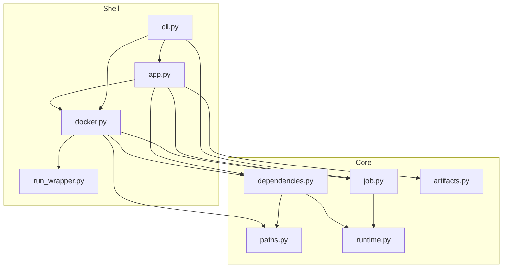

# Architecture

AWS Glue Toolkit is a **flat** Python package (no subpackages) organized in
**two layers**: **core** (domain) and **shell** (I/O and orchestration).

## Core

Domain facts, rules, and transforms. No CLI, Docker subprocesses, or terminal I/O.

| Module | Responsibility |
| --- | --- |
| `paths.py` | Container mount constants; host→container path mapping |
| `runtime.py` | Bundled Glue version JSON → `GlueRuntimeMetadata` |
| `job.py` | `pyproject.toml` validation → `GlueJobProject` |
| `dependencies.py` | PEP 508 prep; pip dry-run, `pip wheel` / `pip download`, image-pin filtering; staged install for run/test; `PipRunner` injection |
| `artifacts.py` | Zip layout for `.dependencies.zip` and gluewheels tree staging |

Core modules must not import `docker`, `cli`, or `app`. Allowed sibling
imports: `job` → `runtime`, `dependencies` → `runtime`, `dependencies` → `paths`.

## Shell

Process boundaries and use-case orchestration:

| Role | Module | Responsibility |
| --- | --- | --- |
| **Infra** | `docker.py` | `docker run` argv builders, `run_job`, `run_tests`, `run_pip_in_container`, `pip_runner`, `host_pip_runner`; host pip config snapshot → mounted `pip.conf` |
| **Infra** | `run_wrapper.py` | `spark-submit` entry for `gtk run`; clean container exit after the job |
| **Application** | `app.py` | `check`, `build`, `run`, `test`; wires `dependencies` to host or container pip runners |
| **Presentation** | `cli.py` | `gtk` entry point, `GtkCommandError`, exit codes, Rich panels |

`app` raises domain exceptions (`PipError`, `DockerError`, `ValueError`,
`OSError`, `RequirementPreparationError`) for `cli` to translate.

## Module graph

- **Core** must not import `docker`, `cli`, or `app`.
- **`dependencies`** must not import **`docker`** — use an injected `PipRunner` instead.
- Multi-step workflows that need both pip and Docker are wired in **`app`**. `cli` may import both for error mapping; `docker` may use `dependencies` helpers for pip-in-container.
- **`run_wrapper.py`** is mounted into the Glue container by `docker.run_job` as the `spark-submit` entry script.

## Command flows

### `gtk check`

`cli` → `app.check` → `dependencies.prepare_requirements` → `dependencies.resolve_packages` → `docker.run_pip_in_container`

### `gtk build`

1. `artifacts.build_dependencies_zip` (host)
2. `app.build` → `dependencies.prepare_requirements`
3. `artifacts.stage_gluewheels_zip` → `dependencies.bundle_wheels` → `artifacts.write_gluewheels_tree` → zip

Default ``--mode host``: host `file:` paths, `host_pip_runner`; recipe is path/VCS `pip wheel --no-deps` → resolve pins → per pin `pip download --only-binary` or sdist→wheel → portable assert; same pin omit.

``--mode container``: `pip wheel` in Docker via `pip_runner`; omit Glue image pins.

### `gtk run` / `gtk test`

`cli` → `app.run` / `app.test` → `dependencies.prepare_requirements` (when
deps are present) → `dependencies.staged_requirements` →
`docker.run_job` / `docker.run_tests` (pip install ``--target`` then
spark-submit / pytest in one ephemeral container).

For `gtk run`, `docker.run_job` mounts `run_wrapper.py` as the
`spark-submit` entry so the container returns after the job script
finishes.

## Git and VCS dependencies

Git direct URLs are passed through to pip. See
[README.md](../README.md#dependency-forms) for supported forms and limits.

## Adding code

1. Fact, rule, or transform → core (`paths`, `runtime`, `job`, `dependencies`, `artifacts`)
2. Multi-step user workflow → `app.py`
3. Subprocess or Docker argv → `docker.py`
4. In-container `spark-submit` entry for `gtk run` → `run_wrapper.py`
5. Terminal, Cyclopts, or exit codes → `cli.py`

If a change needs both pip and Docker for a user-facing workflow, wire it in
**`app`**, not in **`dependencies`**.

## Public API

Library callers typically import:

- `from aws_glue_toolkit.job import load_pyproject, GlueJobProject`
- `from aws_glue_toolkit.runtime import load_runtime`
- `from aws_glue_toolkit.dependencies import prepare_requirements`
- `from aws_glue_toolkit.artifacts import build_dependencies_zip`
- `from aws_glue_toolkit.app import check, build, run, test`

The `gtk` CLI is registered at `aws_glue_toolkit.cli:app`.
